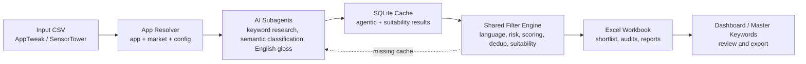

# ASO-MVP

## What Is ASO-MVP?

ASO-MVP is a local ASO keyword pipeline that uses Antigravity AI subagents to research, classify, and filter keywords quickly and consistently.

It combines AI-assisted keyword judgment with strict deterministic filtering layers, then turns raw keyword CSV exports into audited Excel workbooks for each app and market.

## Features

- App and market resolution from CSV names or explicit app aliases.
- Shared hard filters, language policy, risk rules, scoring, deduplication, and diversity selection.
- Cache-only agentic keyword classification and English gloss resolution.
- Metadata/ads suitability audit for Play Store acquisition fit.
- One workbook output per run under `apps/<AppName>/Output/<MMYYYY>/`.
- Project Memory snapshots in the workbook, dashboard, and app folder.
- Batch runner for multi-app or multi-market jobs.
- Local dashboard and Master Keywords export tools.

## How It Works



| Layer | Role | Main Files |
|---|---|---|
| App Workspace | Stores each app's config, profile, inputs, outputs, and project memory. | `apps/<AppName>/` |
| AI Subagents | Research keywords, classify semantic intent, create English glosses, and audit suitability. | `.agents/skills/`, `tools/warm_cache_helper.py`, `tools/suitability_cache_helper.py` |
| Cache | Keeps AI results deterministic at runtime. Runners read cache only and fail fast on misses. | `.cache/agentic_keyword_analysis.sqlite3` |
| Filter Engine | Applies strict language, risk, scoring, deduplication, diversity, and metadata suitability rules. | `shared/keyword_filter/`, `shared/language_detector.py` |
| Output | Produces the final review workbook and optional dashboard/export artifacts. | `apps/<AppName>/Output/`, `tracker/`, `data/master_keywords/` |

## Quick Start

Install dependencies:

```powershell
python -m venv .venv
.\.venv\Scripts\Activate.ps1
python -m pip install --upgrade pip
python -m pip install -r requirements.txt
```

Run a pipeline:

```powershell
python run_aso_filter.py --csv "apps/<AppName>/Input/<MMYYYY>/<file>.csv" --app <AppName>
```

Interactive mode:

```powershell
python run_aso_filter.py --csv "C:\path\to\<AppName>_<MARKET>.csv" --app <AppName> --interactive
```

Normal operating flow:

```text
verify agentic cache
-> warm agentic cache if needed
-> run pipeline
-> warm suitability cache if the runner exports a candidate pool
-> rerun pipeline
-> review the workbook
```

Useful cache checks:

```powershell
python tools/warm_cache_helper.py verify-cache --app <AppName> --csv "<input-csv>" --market <MARKET>
python tools/suitability_cache_helper.py verify-cache --app <AppName> --csv "<candidate-pool-csv>" --market <MARKET>
```

For the full operator checklist, use [docs/USAGE.md](docs/USAGE.md).

## Architecture

```text
apps/                 Per-app workspaces: config, profile, inputs, outputs
shared/               Shared ASO engine and support modules
tools/                Cache, suitability, batch, and export helpers
tracker/              Local dashboard
docs/                 Specs, setup guides, templates
tests/                Regression tests
data/                 Shared resources and generated master keyword exports
run_aso_filter.py     Main pipeline entrypoint
run_aso_batch.py      Compatibility wrapper for tools/run_aso_batch.py
export_master_keywords.py
```

Each app workspace normally contains:

```text
apps/<AppName>/
|-- app_config.py
|-- App_Profile.json
|-- PROJECT_MEMORY.md
|-- Input/<MMYYYY>/
`-- Output/<MMYYYY>/
```

Core runtime modules:

- `shared/app_registry.py`: resolves app aliases, folders, runners, and configs.
- `shared/keyword_filter/`: filtering, classification, scoring, suitability, selector, reports.
- `shared/agentic_keyword_classifier.py`: cache-only semantic classification.
- `shared/en_gloss_resolver.py`: cache/CSV-based English gloss resolution.
- `shared/language_detector.py`: market language grouping.
- `shared/project_memory.py`: setup snapshots for workbook, dashboard, and app docs.

Runtime rules:

- Runners do not call AI, translation services, or web APIs.
- Missing agentic cache or English gloss rows fail fast.
- Missing suitability cache for audited candidates fails fast and exports a candidate pool.
- `01_Main_Keyword_Shortlist` only accepts `MetadataEligible=True` rows.

## Skills

Agent workflows live under `.agents/skills/`. The most important ones are:

- `run-pipeline-aso`: end-to-end pipeline orchestration for a registered app and market.
- `warm-agentic-cache`: fills missing semantic classification and English gloss cache using subagents.
- `warm-suitability-cache`: audits metadata/ads suitability from a post-classification candidate pool.
- `aso-keyword-research`: expands seed keywords before filtering.
- `create-profile`: creates or repairs an app `App_Profile.json`.

Use skills when working through Codex/Antigravity-style agents. Use `tools/*.py` commands when operating the pipeline directly from the terminal.

## Batch, Dashboard, And Exports

Batch manifest example:

```json
{
  "jobs": [
    {"app": "Pranky", "csv": "path/to/Pranky_US_EN.csv"},
    {"app": "ARFilter", "csv": "path/to/ARFilter_BR_PT.csv"}
  ]
}
```

Run batch:

```powershell
python run_aso_batch.py --manifest path\to\manifest.json
```

Run dashboard:

```powershell
python tracker/run_dashboard.py
```

Open `http://127.0.0.1:5100`.

Export master keywords:

```powershell
python export_master_keywords.py --all
```

## Tests

```powershell
python -m unittest discover -s tests -v
python -m compileall -q .
```

Focused v4.5 checks:

```powershell
python -m unittest tests.test_metadata_suitability tests.test_main_shortlist_builder tests.test_suitability_cache_helper tests.test_pipeline_shared_contract
```

## Documentation

- [Usage guide](docs/USAGE.md)
- [Pipeline spec v4.5](docs/ASO_Keyword_Planner_v4_5.md)
- [Windows setup](docs/SETUP_WINDOWS.md)
- [File guide](docs/README_File_Guide.md)
- [App config template](docs/App_Config_Template.py)
- [New app template](apps/App_Template/README.md)
